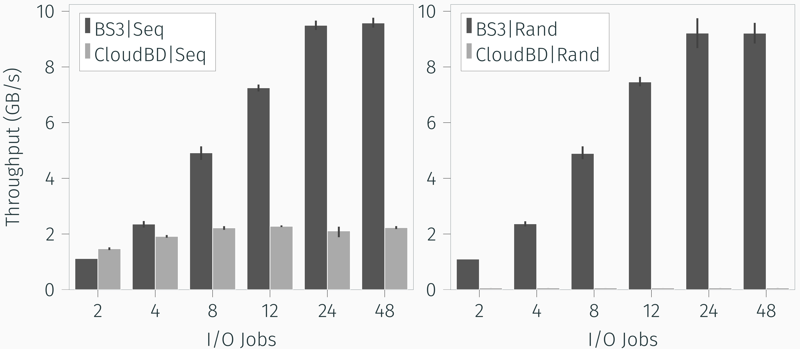

# BS3: Block Device in S3

## Write Performance Comparison

<p align="center">  </p>

## Requirements

* BUSE
* GNU Make
* Go 1.16 or newer

## Installation

```
make
sudo make install
```

## Usage

```
# Edit /etc/bs3/config.toml first

systemctl start bs3
systemctl status bs3
systemctl stop bs3
```
